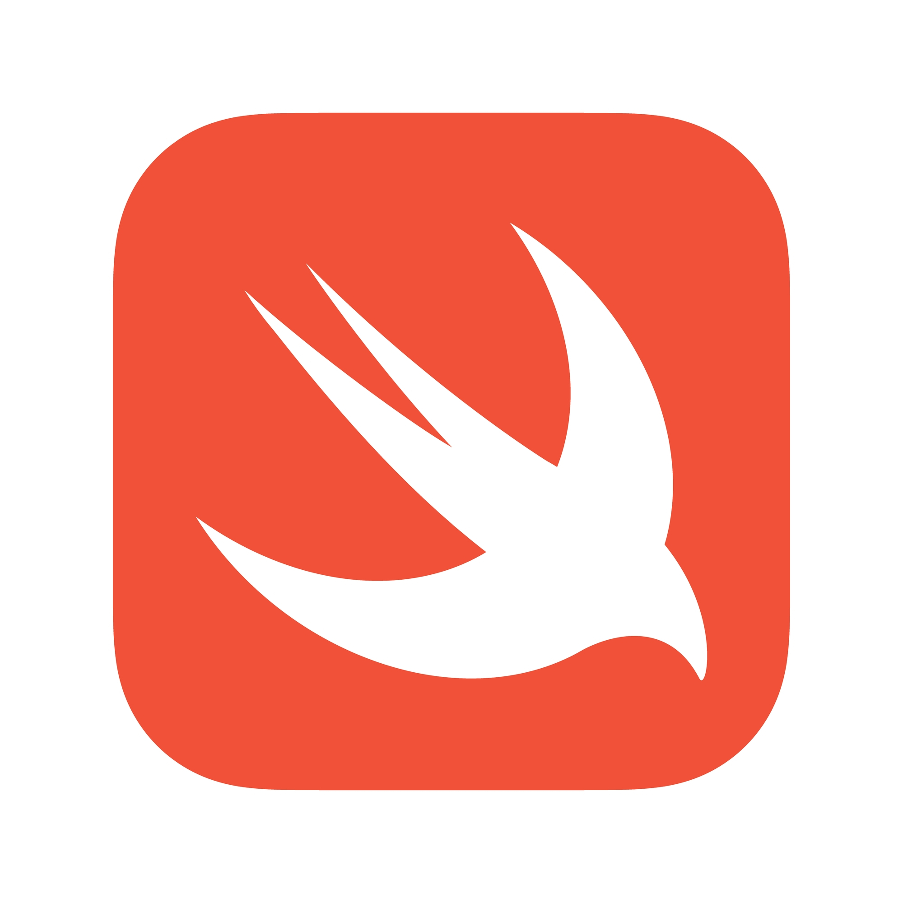

<br/>
<p align="center">
    <a href="https://github.com/TheArchitect123/SwiftTcp"></a>
</p>

<p align="center">
A native swift tcp client library suitable for low level embedded devices. Uses NWConnection & Apple's low level networking apis. 
Backportable to iOS 12+, and supports old mac devices.

## How it works
SwiftTcp handles all the websocket connections, ping & pong between the client & server, when data is received from your device, and runs a periodic ping every 10 seconds to maintain a healthy connection. Suitable for low level devices that use tcp for communicating commands to and from your app. 

**Available as a swift package**
```sh
https://github.com/TheArchitect123/SwiftTcp.git
```

To use SwiftTcp, generate an instance of your socket, pass the Url + your port number for which the socket connects to. 

```sh
 let socketConnection = SwiftTcpService()
 socketConnection.setClientIP(hostAddress: "wss://mysupersecret_websocket", hostIP: 19219)  // prepare your socket connection

 socketConnection.sendData([0xA4,0x12,0xBC,0xAD]){ data in 
     // process the response from your device
 }
```

After your Socket is configured, startup the connection.

```sh
 socketConnection.startConnection()
```

Make sure to close your web socket connection after you are done with it to avoid battery issues.

```sh
socketConnection.closeConnection()
```

## License

This software is licensed under the MIT license. See [LICENSE](./LICENSE) for full disclosure.
